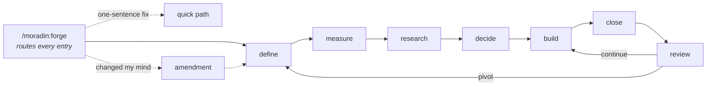

# Moradin — The Forge

[](docs/forge_plan.md)
[](https://opensource.org/licenses/MIT)
[](https://claude.com/plugins)
[](https://agentskills.io)
[](https://github.com/CloseTheLoops/moradin/generate)

> **A guided pipeline from "I have an idea" to "I shipped a product" — with the expert judgment encoded in the process, and a memory that makes every project better than the last.**

You open your AI coding agent (Claude Code, Cursor, Codex, Gemini, Hermes) in this directory, say what you want to build, and type `/moradin:forge`. The pipeline takes it from there.



> **Heads up:** Moradin is *not* a running agent and *not* a website. No port, no server, no account. Markdown files and a few stdlib Python scripts, alive only while your agent has them open. Every project you build carries its own `.forge/` state folder — portable, readable without Moradin at all.

## What makes it different

**It calibrates to you, per task.** A first-run interview sets how much process you actually want (Light/Medium/Full) — and one-sentence fixes always take the quick path. Nobody abandons an 18-step ritual here, because you never get one you didn't ask for.

**You agree on the numbers before writing code.** The measure stage produces a Success Contract — one metric, a target, and a *kill line* — confirmed on a clickable page. A month later, the review stage actually reads it and says continue, pivot, or stop. A clean kill is the process working.

**Research is verified, not vibed.** Every recommended tool passes 9 checks against live sources *today*: the package exists, the pricing page says what we claim, a real API call confirmed the data's shape, the free tier can't silently become a $100k bill.

**Decisions are clicked, then locked.** Three options per decision with a recommended default, exported from a page. Each choice becomes a record with the why-nots and an event trigger for revisiting. Accepted decisions are never re-argued — only superseded.

**Builds are checked, closes are evidence-based.** Vertical slices, each proven by a check that actually runs. The close stage sweeps what really sinks vibe-coded products: secrets in git history, endpoints open to logged-out strangers, backups nobody ever restored, bills nobody capped.

## Quickstart

```bash
# Use the GitHub template button to create your private instance, then:
git clone https://github.com/<your-username>/<your-moradin>.git ~/Documents/moradin
cd ~/Documents/moradin
claude          # or cursor . — any agent that reads AGENTS.md
```

```
/moradin:init     # one-time workshop setup
/moradin:forge    # name a project folder or a brand-new idea — it routes you from there
```

Projects are built in **sibling folders** (`~/Documents/my-app`, next to Moradin) — never inside it. Each carries its own `.forge/` state; `/moradin:forge` reads a 3-line journal and always knows where you left off, even three weeks later.

## The memory layer

Under `memory/`: **principles · patterns · references · lessons · preferences**. The pipeline consults it going in (research cites dated tool references; calibration pre-fills from your preferences) and feeds it coming out (every close writes lessons from real incidents). Maintenance verbs: `capture`, `recall`, `audit`, `stats`, `retrospect`, `learn-from-sessions`. This layer is what makes *your* Moradin yours.

## Documentation

| Read this | When |
|---|---|
| [QUICKSTART](docs/QUICKSTART.md) | Setting up in 5 minutes |
| [CONCEPTS](docs/CONCEPTS.md) | Understanding the layers |
| [The forge plan](docs/forge_plan.md) | Why the pipeline is shaped this way |
| [Evidence base](docs/forge_research/) | The research behind every design law |
| [SESSION_MINING](docs/SESSION_MINING.md) | Bootstrapping preferences from session history |
| [CONTRIBUTING](docs/CONTRIBUTING.md) · [FAQ](docs/FAQ.md) | Contributing · common questions |

## What's inside

```
moradin/
  AGENTS.md / CLAUDE.md   ← identity + design laws (loaded every session)
  skills/                 ← 15 SKILL.md verbs: 8 pipeline + 7 maintenance
  memory/                 ← the five content types (yours; gitignored from the framework)
  templates/              ← .forge/ state + memory file scaffolds
  scripts/                ← stdlib-only Python (search, audit, indexes)
  docs/                   ← guides + the plan + its evidence
```

## Updating from upstream

```bash
./scripts/update.sh   # merges framework changes; your memory/ and projects/ stay yours
```

## Feedback

Tried it? [FEEDBACK.md](FEEDBACK.md) has the questions we actually want answered — bluntness welcome.

## License

MIT — see `LICENSE`.
